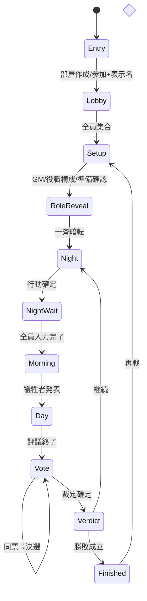

# モバイル UI + デザインシステム 設計書

日付: 2026-07-19
入力仕様: `prompts/claude-design/02-mobile-ui-design-prompt.md`, `prompts/claude-design/03-design-system-prompt.md`
正本: `design/current-card-design.md`(カード表現は変更禁止)

## 目的

スマートフォンだけで完結する対面人狼ゲームの UI を、既存カードデザイン(Refined 透過 + 背景合成、`card_viewer.html` のタイトル表現)を主役にしたまま、モバイルファーストで実装する。今回のスコープは「デザイン実装」= デザインシステム(トークン+コンポーネント)と、全主要画面を遷移できるインタラクティブ・プロトタイプ。Firebase 同期やルールエンジンは対象外(モックデータで状態を再現する)。

## 成果物(3点 + 文書)

1. `design-system.css` — 3層トークン(primitive / semantic / component)+ 共通コンポーネント CSS。CSS custom properties。`data-phase` 属性で day / night / dawn / verdict / finished を切り替える。
2. `design/design-system.md` — トークン表、コンポーネント一覧、公開/秘密/concealed コンテキスト規則、アクセシビリティチェックリスト。デザイン正本フォルダに置き、`design/README.md` の読む順番へ追記する。
3. `mobile_app.html` — 390×844 基準のモバイルプロトタイプ。1ファイル内に全画面(下記20フロー)を実装し、実際に遷移・操作できる。file:// で直接開ける。デモ用に画面ジャンプ用の隠しナビ(右上長押しで開く dev drawer)を持つ。
4. 本設計書内に IA / user flow / state diagram(mermaid)を含める。

## 世界観との接続

画面 = 旧世界の記録網へ接続する個人端末。「記録者」の文体は静か・正確・中立・短文(03プロンプトの推奨例をそのまま採用)。重要操作は普通の日本語を主表記にし、劇中用語は補助(例:「部屋をつくる — 区画名簿を開設」)。

## デザイントークン

### Primitive(抜粋 — 実装時にフルテーブル化)

- 色(Neutral): `soot #07080a` / `charcoal #0d0f12` / `surface #111317` / `ash #94a3b8` / `paper #e8e0cf`(古紙) / `oxidized #8a8f98` / `line rgba(255,255,255,0.08)`(既存ボーダー踏襲) / `text #f1f5f9`
- 色(Phase): day = くすんだ紙 + 青灰(`#1a1d24` 地に `#b7c3d0` 光)、night = 炭色 + 月光(`#07080a` 地に `#9fb4c7` 光)、dawn = 灰 + 鈍い橙 `#b97a3d`、verdict = 深い鉄赤 `#7a2226` を差し色、finished = 古紙系
- 色(Faction — 秘密コンテキスト限定): citizen = 煤けた青緑 `#4a6a5f`、werewolf = 暗紅 `#8f1d22`、third = 人工緑/月光 `#5f8f7a`。role accent は `--role-accent` として役職ごとに拡張可能な構造
- 色(Semantic): success `#4a7a5a` / warning `#b08a3d` / danger `#a03a30` / info `#5a7a9a` / offline `#6a6a72` / reconnecting `#b08a3d` / disabled 40% text
- Typography: body = `LINE Seed JP`(400/700。既存カードは700のみ読み込みなので 400 を追加読み込み)、display = `Cinzel Decorative` 900(儀式的場面のみ)、timer/code = `IBM Plex Mono`(旧世界端末の印字。tabular で 6 桁コード・タイマーに使用)。type scale: display 28 / heading 20 / body 15 / label 13 / caption 12 / timer 40 / code 32。12px 未満は使わない
- Spacing: 4px 基準(4/8/12/16/20/24/32/48)。radius: 6(control)/12(sheet)/16(card=既存カード踏襲)。touch target 最低 44×44
- Motion: instant 120ms / micro 200ms / phase 600ms / cinematic 1200ms。`prefers-reduced-motion` では phase 以上をクロスフェードのみへ縮退

### Semantic 層の原則

- 公開 UI 用トークン(`--pub-*`)と秘密 UI 用トークン(`--secret-*`)を分離。夜画面の外観は全プレイヤー共通トークンのみで構成し、faction / role accent は `HoldToReveal` 内部でしか参照しない
- 色だけに意味を持たせない: 状態は必ずラベル+アイコン/形状を併用

## コンポーネント(実装対象)

Foundation: AppShell / SafeAreaFrame / PhaseBackdrop / TextureOverlay(古紙・金属は overlay token、本文の背後に強く敷かない)/ EngravedRule / Typography
Actions: Button(primary / secondary / quiet / danger / hold-to-confirm)/ SegmentedControl / TextField / CodeInput(6桁)/ ReadyControl / PlayerTargetSelector / VoteBallot
Information: PhaseHeader(フェーズ名+すべきこと+残り時間+同期状態の4点を常時表示)/ CountdownTimer / RecorderMessage / StatusBadge / ConnectionBanner / SyncIndicator / WaitingCount(「あと n 人」・名前非公開)/ InlineNotice / Toast / ErrorRecoveryPanel
Game: QRJoinPanel(quiet zone 確保・白地)/ RoomCode / PlayerList / RoleCard(card_viewer 再利用)/ PrivacyCover / HoldToReveal / NightActionPanel / DiscussionTimer / VoteResult / EliminationReveal / VictoryReveal / RoleRosterReveal / RematchPanel
Overlays: BottomSheet / Dialog / FullScreenReveal / RulesDrawer / ReconnectOverlay

状態は必要なもののみ定義(default / pressed / disabled / loading / error / offline / reconnecting / completed 等)。

## カード表現の規則(正本遵守)

- RoleCard は `card_viewer.html` の DOM 構造・CSS・rolesData・REFINED_POSITIONS をそのまま移植する(書き換え禁止)。アセット: `00_transparent-illustrations-72-a-refined/{id}_ver_a.png` + `backgrounds-72/{id}_bg.png`、`magician_c` のみ例外規則
- 360×640 のカードを画面幅に合わせ `transform: scale()` で縮小表示(内部レイアウトは 360×640 固定なのでタイトル位置が崩れない)
- カードを大きく見せるのは役職確認とゲーム終了のみ。他画面では装飾として乱用しない

## 秘密保持の設計

- HoldToReveal: PrivacyCover(全役職共通の外観 = 封蝋された機密記録)→ 長押し中のみカード表示 → 指を離すと即時(≤120ms)で cover へ戻る。pointerdown/up + pointercancel で実装
- 夜画面: 全役職が同一の外観・同一の待機時間構造。役職行動がある場合も NightActionPanel は共通トーンで表示し、role accent は使わない
- 犠牲者通知は朝フェーズで全員同時
- 音・振動は共通フェーズ通知のみ(プロトタイプでは実装せず仕様記載)

## 画面フロー(プロトタイプに含める)

01 起動 → 02 つくる/入る選択 → 03 参加(QR/リンク/6桁)→ 04 表示名 → 05 ロビー → 06 GMモード選択 → 07 役職構成 → 08 準備確認 → 09 役職確認(privacy reveal)→ 10 一斉暗転 → 11 夜の行動 → 12 共通待機 → 13 朝の発表 → 14 昼の議論+タイマー → 15 投票(選択→確認→確定)→ 16 同票処理 → 17 処刑結果 → 18 勝敗+全役職公開 → 19 再戦 → 20 再接続オーバーレイ(任意画面から発動可能)

state diagram:

役割視点: ホスト(部屋作成・QR提示・進行開始権限)/ 一般プレイヤー / 人間GM(進行操作のみ、秘密情報はシステム保持)。プロトタイプでは dev drawer で視点を切替。

## エラー・回復状態

ConnectionBanner(offline / reconnecting)、ReconnectOverlay(「接続を復旧しています」+ 最後に確認した状態 + 再試行)、SyncIndicator(記録済み/送信中)、重複送信防止(確定後はボタンを completed 状態へ)。戻る操作での誤退出は確認 Dialog(退出のみ・毎操作には出さない)。

## アクセシビリティ

WCAG AA(本文コントラスト)、44px タップ領域、`prefers-reduced-motion` 対応、色以外の状態表現、日本語長文字列の折返し、200% 拡大耐性(rem ベース)、QR quiet zone。

## 実装分担(モデル割当)

| タスク | 担当 | モデル | 理由 |
|---|---|---|---|
| 探索・資料整理 | Explore agent | haiku | 機械的収集 |
| 設計書・計画・最終監査 | メインループ | fable | 設計判断の品質が最重要 |
| design-system.css + design/design-system.md | subagent | sonnet | 仕様が固まった実装作業 |
| mobile_app.html(画面実装) | subagent | sonnet | 詳細仕様に基づく実装。fable が監査・修正 |
| コードレビュー | subagent | sonnet | 検証作業 |

## テスト・検証

- `tests/` の既存パターンに合わせ、静的チェックのシェルテスト(必須アセット参照・トークン定義・画面IDの存在)を追加
- 最終監査: 02/03 プロンプト末尾の自己レビュー項目(秘密の覗き見耐性、人狼判別不能性、再接続復帰、初見理解、議論への回帰、360px/200%耐性)をチェックリストとして実施
